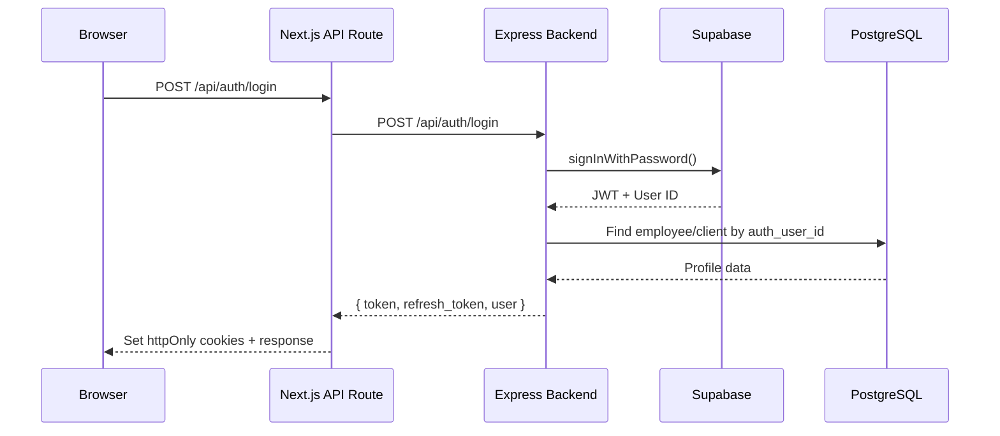
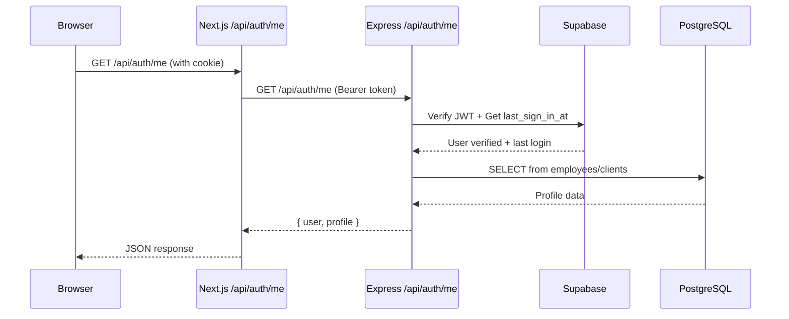
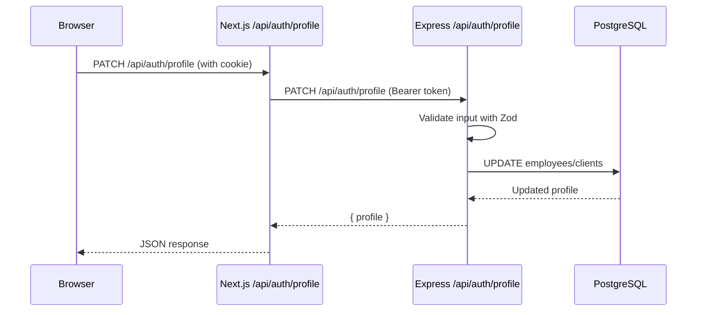

# 👤 User Profile API — Complete Documentation

> **Last Updated:** March 2, 2026  
> **Status:** ✅ Fully Implemented & Tested  
> **Location:** Backend (`server/src/controllers/auth.controller.ts`) + Frontend (`client/features/profile/`)

---

## 📋 Table of Contents

1. [Overview](#overview)
2. [Backend Implementation](#backend-implementation)
3. [Frontend Integration](#frontend-integration)
4. [API Endpoints](#api-endpoints)
5. [Data Models](#data-models)
6. [Authentication Flow](#authentication-flow)
7. [Testing Guide](#testing-guide)
8. [File Locations](#file-locations)

---

## 🎯 Overview

The User Profile system allows authenticated users (both employees and clients) to:
- ✅ View their complete profile information
- ✅ Update their personal details (name, phone, address)
- ✅ Change their password securely
- ✅ See their last login timestamp
- ✅ Access role-based permissions (employees only)

**Security Features:**
- JWT-based authentication via Supabase
- httpOnly cookies prevent XSS attacks
- Password validation before changes
- Role-based access control

---

## 🔧 Backend Implementation

### Location
```
server/src/
├── controllers/auth.controller.ts    # Profile endpoints (getMe, updateProfile, changePassword)
├── routes/auth.routes.ts             # Route definitions
├── validators/auth.validator.ts      # Request validation schemas
├── middlewares/auth.middleware.ts    # JWT authentication
└── types/index.ts                    # TypeScript interfaces
```

### Core Functions

#### 1. **Get Profile** (`getMe`)
- **Endpoint:** `GET /api/auth/me`
- **Auth:** Required (JWT Bearer token)
- **Purpose:** Returns current user's profile with role/access info

**Implementation:**
```typescript
// Location: server/src/controllers/auth.controller.ts (line 309-378)

export const getMe = async (req, res, next) => {
  // 1. Verify user is authenticated
  if (!req.user) {
    return res.status(401).json({ success: false, error: "Not authenticated" });
  }

  // 2. Fetch last login from Supabase
  const { data: userData } = await supabaseAdmin.auth.admin.getUserById(req.user.id);
  const lastLogin = userData?.user?.last_sign_in_at || null;

  // 3. Fetch profile based on user type
  let profile = {};
  if (req.user.user_type === "employee") {
    const emp = await prisma.employees.findUnique({
      where: { id: req.user.profile_id }
    });
    profile = {
      id: emp.id,
      full_name: emp.full_name,
      email: emp.email,
      phone: emp.phone,
      role: emp.role,              // owner | admin | employee
      access: emp.access,          // { rent: true, electricity: false, ... }
      address: emp.address,
      last_login: lastLogin,
      is_active: emp.is_active,
      created_at: emp.created_at
    };
  } else {
    const cli = await prisma.clients.findUnique({
      where: { id: req.user.profile_id }
    });
    profile = {
      id: cli.id,
      full_name: cli.full_name,
      email: cli.email,
      phone: cli.phone,
      address: cli.address,
      last_login: lastLogin,
      created_at: cli.created_at
    };
  }

  // 4. Return combined data
  res.json({
    success: true,
    data: {
      user: req.user,    // { id, email, user_type, profile_id, role?, access? }
      profile: profile
    }
  });
};
```

#### 2. **Update Profile** (`updateProfile`)
- **Endpoint:** `PATCH /api/auth/profile`
- **Auth:** Required (JWT Bearer token)
- **Purpose:** Update user's name, phone, or address

**Implementation:**
```typescript
// Location: server/src/controllers/auth.controller.ts (line 385-443)

export const updateProfile = async (req, res, next) => {
  // 1. Validate input
  const parsed = updateProfileSchema.safeParse(req.body);
  if (!parsed.success) {
    return res.status(400).json({
      success: false,
      error: "Validation failed",
      details: parsed.error.flatten().fieldErrors
    });
  }

  const { full_name, phone, address } = parsed.data;

  // 2. Update based on user type
  if (req.user.user_type === "employee") {
    const data = {};
    if (full_name !== undefined) data.full_name = full_name;
    if (phone !== undefined) data.phone = phone;
    
    // Check if address column exists (backward compatibility)
    const cols = await prisma.$queryRaw`
      SELECT column_name FROM information_schema.columns 
      WHERE table_name='employees' AND column_name='address'
    `;
    if (cols.length > 0 && address !== undefined) {
      data.address = address;
    }

    const updated = await prisma.employees.update({
      where: { id: req.user.profile_id },
      data
    });

    return res.json({
      success: true,
      data: { profile: { ...updated } }
    });
  }

  // Client update
  if (req.user.user_type === "client") {
    const data = {};
    if (full_name !== undefined) data.full_name = full_name;
    if (phone !== undefined) data.phone = phone;
    if (address !== undefined) data.address = address;

    const updated = await prisma.clients.update({
      where: { id: req.user.profile_id },
      data
    });

    return res.json({
      success: true,
      data: { profile: { ...updated } }
    });
  }
};
```

#### 3. **Change Password** (`changePassword`)
- **Endpoint:** `PATCH /api/auth/change-password`
- **Auth:** Required (JWT Bearer token)
- **Purpose:** Securely change user's password

**Implementation:**
```typescript
// Location: server/src/controllers/auth.controller.ts (line 236-308)

export const changePassword = async (req, res, next) => {
  // 1. Validate input (current_password, new_password, confirm_password)
  const parsed = changePasswordSchema.safeParse(req.body);
  if (!parsed.success) {
    return res.status(400).json({
      success: false,
      error: "Validation failed",
      details: parsed.error.flatten().fieldErrors
    });
  }

  const { current_password, new_password } = parsed.data;

  // 2. Get user's email from Supabase
  const { data: userData } = await supabaseAdmin.auth.admin.getUserById(req.user.id);
  const email = userData?.user?.email;

  // 3. Verify current password
  const { error: signInError } = await supabase.auth.signInWithPassword({
    email,
    password: current_password
  });
  
  if (signInError) {
    return res.status(400).json({
      success: false,
      error: "Current password is incorrect"
    });
  }

  // 4. Update to new password
  const { error: updateError } = await supabaseAdmin.auth.admin.updateUserById(
    req.user.id,
    { password: new_password }
  );

  if (updateError) {
    return res.status(500).json({
      success: false,
      error: "Failed to update password"
    });
  }

  res.json({
    success: true,
    message: "Password changed successfully"
  });
};
```

---

## 🎨 Frontend Integration

### Location
```
client/
├── features/profile/
│   ├── types.ts                    # TypeScript interfaces
│   ├── api/profile.ts              # API functions
│   ├── AdminProfilePage.tsx        # Profile page component
│   └── components/                 # Profile UI components
├── app/api/auth/
│   ├── me/route.ts                 # Next.js proxy for GET /auth/me
│   └── profile/route.ts            # Next.js proxy for PATCH /auth/profile
└── lib/auth-client.ts              # Auth utilities
```

### Type Definitions

**File:** `client/features/profile/types.ts`

```typescript
// Employee profile structure
export interface EmployeeProfile {
  id: string;
  full_name: string;
  email: string;
  phone: string;
  address: string | null;
  role: "owner" | "admin" | "employee";
  access: Record<string, boolean>;  // { rent: true, electricity: false, ... }
  is_active: boolean;
  created_at: string;
  last_login: string | null;
}

// Client profile structure
export interface ClientProfile {
  id: string;
  full_name: string;
  email: string;
  phone: string;
  address: string | null;
  created_at: string;
  last_login: string | null;
}

// Union type
export type UserProfile = EmployeeProfile | ClientProfile;

// API response from GET /api/auth/me
export interface GetProfileResponse {
  user: {
    id: string;
    email: string;
    user_type: "employee" | "client";
    profile_id: string;
    role?: string;
    access?: Record<string, boolean>;
  };
  profile: UserProfile;
}

// Update profile request body
export interface UpdateProfileInput {
  full_name?: string;
  phone?: string;
  address?: string;
}

// Update profile response
export interface UpdateProfileResponse {
  user: AuthUser;
  profile: UserProfile;
}
```

### API Functions

**File:** `client/features/profile/api/profile.ts`

```typescript
/**
 * Fetch user profile via Next.js proxy (uses httpOnly cookie)
 * Recommended for initial page load in client components
 */
export async function getProfileFromProxy(): Promise<GetProfileResponse> {
  const response = await fetch("/api/auth/me", {
    method: "GET",
    cache: "no-store",
  });

  if (!response.ok) {
    throw new Error(`Failed to fetch profile: ${response.statusText}`);
  }

  const json = await response.json();
  if (!json.success) {
    throw new Error(json.error || "Failed to fetch profile");
  }

  return json.data as GetProfileResponse;
}

/**
 * Update user profile via Next.js proxy (uses httpOnly cookie)
 * Recommended for profile updates in client components
 */
export async function updateProfileViaProxy(
  data: UpdateProfileInput
): Promise<UpdateProfileResponse> {
  const response = await fetch("/api/auth/profile", {
    method: "PATCH",
    headers: { "Content-Type": "application/json" },
    body: JSON.stringify(data),
  });

  if (!response.ok) {
    throw new Error(`Failed to update profile: ${response.statusText}`);
  }

  const json = await response.json();
  if (!json.success) {
    throw new Error(json.error || "Failed to update profile");
  }

  return json.data as UpdateProfileResponse;
}

/**
 * Change user password via Next.js proxy
 */
export async function changePassword(
  oldPassword: string,
  newPassword: string
): Promise<{ success: boolean; message: string }> {
  const response = await fetch("/api/auth/change-password", {
    method: "POST",
    headers: { "Content-Type": "application/json" },
    body: JSON.stringify({
      oldPassword,
      newPassword,
    }),
  });

  if (!response.ok) {
    throw new Error(`Failed to change password: ${response.statusText}`);
  }

  const json = await response.json();
  if (!json.success) {
    throw new Error(json.error || "Failed to change password");
  }

  return json.data;
}
```

### Usage Example

**File:** `client/features/profile/AdminProfilePage.tsx`

```typescript
"use client";

import { useEffect, useState } from "react";
import { getProfileFromProxy, updateProfileViaProxy } from "./api/profile";

export default function ProfilePage() {
  const [profile, setProfile] = useState(null);
  const [loading, setLoading] = useState(true);

  // Load profile on mount
  useEffect(() => {
    async function loadProfile() {
      try {
        setLoading(true);
        const response = await getProfileFromProxy();
        
        // Map to local state
        setProfile({
          fullName: response.profile.full_name,
          email: response.profile.email,
          phone: response.profile.phone,
          address: response.profile.address,
          role: "role" in response.profile ? response.profile.role : "client",
          // ... etc
        });
      } catch (error) {
        console.error("Failed to load profile:", error);
      } finally {
        setLoading(false);
      }
    }

    loadProfile();
  }, []);

  // Handle profile update
  const handleSaveProfile = async (data) => {
    try {
      setLoading(true);
      const response = await updateProfileViaProxy({
        full_name: data.fullName,
        phone: data.phone,
        address: data.address,
      });

      // Update local state
      setProfile({
        ...profile,
        fullName: response.profile.full_name,
        phone: response.profile.phone,
        address: response.profile.address,
      });

      // Show success message
      alert("Profile updated successfully!");
    } catch (error) {
      console.error("Failed to update profile:", error);
      alert("Failed to update profile");
    } finally {
      setLoading(false);
    }
  };

  return (
    <div>
      {loading ? (
        <div>Loading...</div>
      ) : (
        <ProfileForm profile={profile} onSave={handleSaveProfile} />
      )}
    </div>
  );
}
```

---

## 🌐 API Endpoints

### 1. GET /api/auth/me

**Purpose:** Get current user's profile

**Request:**
```http
GET /api/auth/me
Authorization: Bearer <jwt_token>
```

**Response (Employee):**
```json
{
  "success": true,
  "data": {
    "user": {
      "id": "a0000000-0000-0000-0000-000000000001",
      "email": "yousef@kiswani.lb",
      "user_type": "employee",
      "profile_id": "a0000000-0000-0000-0000-000000000001",
      "role": "owner",
      "access": {
        "rent": true,
        "electricity": true,
        "expenses": true,
        "employees": true,
        "clients": true
      }
    },
    "profile": {
      "id": "a0000000-0000-0000-0000-000000000001",
      "full_name": "Yousef Kiswani",
      "email": "yousef@kiswani.lb",
      "phone": "+961 3 100 001",
      "address": "Beirut, Hamra Street 45",
      "role": "owner",
      "access": {
        "rent": true,
        "electricity": true,
        "expenses": true,
        "employees": true,
        "clients": true
      },
      "is_active": true,
      "created_at": "2025-01-15T10:30:00.000Z",
      "last_login": "2026-03-02T08:45:12.000Z"
    }
  }
}
```

**Response (Client):**
```json
{
  "success": true,
  "data": {
    "user": {
      "id": "b0000000-0000-0000-0000-000000000001",
      "email": "ali.mrad@mail.com",
      "user_type": "client",
      "profile_id": "b0000000-0000-0000-0000-000000000001"
    },
    "profile": {
      "id": "b0000000-0000-0000-0000-000000000001",
      "full_name": "Ali Mrad",
      "email": "ali.mrad@mail.com",
      "phone": "+961 71 200 001",
      "address": "Beirut, Hamra St.",
      "created_at": "2025-02-20T14:15:00.000Z",
      "last_login": "2026-03-01T19:20:00.000Z"
    }
  }
}
```

---

### 2. PATCH /api/auth/profile

**Purpose:** Update current user's profile information

**Request:**
```http
PATCH /api/auth/profile
Authorization: Bearer <jwt_token>
Content-Type: application/json

{
  "full_name": "Yousef Ali Kiswani",
  "phone": "+961 3 100 999",
  "address": "Beirut, Hamra Street 45, Building 12"
}
```

**Validation Rules:**
- `full_name`: Optional, min 1 character
- `phone`: Optional, any string
- `address`: Optional, any string

**Response:**
```json
{
  "success": true,
  "data": {
    "profile": {
      "id": "a0000000-0000-0000-0000-000000000001",
      "full_name": "Yousef Ali Kiswani",
      "email": "yousef@kiswani.lb",
      "phone": "+961 3 100 999",
      "address": "Beirut, Hamra Street 45, Building 12"
    }
  }
}
```

---

### 3. PATCH /api/auth/change-password

**Purpose:** Change user's password securely

**Request:**
```http
PATCH /api/auth/change-password
Authorization: Bearer <jwt_token>
Content-Type: application/json

{
  "current_password": "OldPassword123!",
  "new_password": "NewPassword456!",
  "confirm_password": "NewPassword456!"
}
```

**Validation Rules:**
- `current_password`: Min 6 characters
- `new_password`: Min 6 characters
- `confirm_password`: Must match `new_password`

**Response (Success):**
```json
{
  "success": true,
  "message": "Password changed successfully"
}
```

**Response (Wrong Current Password):**
```json
{
  "success": false,
  "error": "Current password is incorrect"
}
```

---

## 💾 Data Models

### Employees Table

**Schema:** `server/prisma/schema.prisma`

```prisma
model employees {
  id           String        @id @default(dbgenerated("gen_random_uuid()")) @db.Uuid
  auth_user_id String?       @unique @db.Uuid
  full_name    String
  email        String?       @unique
  phone        String?
  address      String?
  role         employee_role @default(employee)  // owner | admin | employee
  access       Json          @default("{}")      // { rent: true, electricity: false, ... }
  is_active    Boolean       @default(true)
  deleted_at   DateTime?     @db.Timestamptz(6)
  created_at   DateTime      @default(now()) @db.Timestamptz(6)
  updated_at   DateTime      @default(now()) @db.Timestamptz(6)
  
  // Relations
  received_bill_payments bill_payments[]
  generated_bills        bills[]
  paid_expenses          expenses[]
  assigned_maintenance   maintenance_requests[]
  set_pricing           pricing_history[]
  managed_properties    properties[]
  recorded_readings     readings[]
  rent_invoices         rent_invoices[]
  received_rent_payments rent_payments[]
}

enum employee_role {
  owner
  admin
  employee
}
```

### Clients Table

**Schema:** `server/prisma/schema.prisma`

```prisma
model clients {
  id            String    @id @default(dbgenerated("gen_random_uuid()")) @db.Uuid
  auth_user_id  String?   @unique @db.Uuid
  full_name     String
  email         String?
  phone         String?
  address       String?
  notes         String?
  deleted_at    DateTime? @db.Timestamptz(6)
  created_at    DateTime  @default(now()) @db.Timestamptz(6)
  updated_at    DateTime  @default(now()) @db.Timestamptz(6)
  
  // Relations
  contracts            contracts[]
  maintenance_requests maintenance_requests[]
  subscribers          subscribers[]
}
```

---

## 🔐 Authentication Flow

### 1. Login Flow



### 2. Profile Fetch Flow



### 3. Profile Update Flow



---

## 🧪 Testing Guide

### Using Postman

#### 1. Login
```http
POST http://localhost:5000/api/auth/login
Content-Type: application/json

{
  "email": "yousef@kiswani.lb",
  "password": "Password123!"
}
```

**Copy the `token` from response.**

#### 2. Get Profile
```http
GET http://localhost:5000/api/auth/me
Authorization: Bearer <paste_token_here>
```

#### 3. Update Profile
```http
PATCH http://localhost:5000/api/auth/profile
Authorization: Bearer <paste_token_here>
Content-Type: application/json

{
  "full_name": "Yousef Ali Kiswani Updated",
  "phone": "+961 3 999 888"
}
```

#### 4. Change Password
```http
PATCH http://localhost:5000/api/auth/change-password
Authorization: Bearer <paste_token_here>
Content-Type: application/json

{
  "current_password": "Password123!",
  "new_password": "NewPassword456!",
  "confirm_password": "NewPassword456!"
}
```

### Using Frontend

1. **Start both servers:**
   ```bash
   # Terminal 1 - Backend
   cd server && npm run dev

   # Terminal 2 - Frontend
   cd client && npm run dev
   ```

2. **Login:**
   - Go to `http://localhost:3000/login`
   - Email: `yousef@kiswani.lb`
   - Password: `Password123!`

3. **View Profile:**
   - Navigate to Admin Dashboard → Profile
   - See your profile information displayed

4. **Update Profile:**
   - Click "Edit Profile" button
   - Modify name, phone, or address
   - Save changes
   - Verify update successful

---

## 📁 File Locations

### Backend Files

| File | Path | Purpose |
|------|------|---------|
| **Auth Controller** | `server/src/controllers/auth.controller.ts` | All profile endpoints (getMe, updateProfile, changePassword) |
| **Auth Routes** | `server/src/routes/auth.routes.ts` | Route definitions for /api/auth/* |
| **Auth Middleware** | `server/src/middlewares/auth.middleware.ts` | JWT verification, user lookup |
| **Auth Validators** | `server/src/validators/auth.validator.ts` | Zod schemas for request validation |
| **Type Definitions** | `server/src/types/index.ts` | TypeScript interfaces (AuthUser, MeResponse, etc.) |
| **Prisma Schema** | `server/prisma/schema.prisma` | Database models (employees, clients) |

### Frontend Files

| File | Path | Purpose |
|------|------|---------|
| **Profile Types** | `client/features/profile/types.ts` | TypeScript interfaces for profile data |
| **Profile API** | `client/features/profile/api/profile.ts` | API functions (getProfileFromProxy, updateProfileViaProxy) |
| **Admin Profile Page** | `client/features/profile/AdminProfilePage.tsx` | Profile page component for employees |
| **Customer Profile Page** | `client/features/profile/CustomerProfilePage.tsx` | Profile page component for clients |
| **Profile Components** | `client/features/profile/components/` | UI components (ProfileHeader, ProfileInfoCard, etc.) |
| **Next.js /me Proxy** | `client/app/api/auth/me/route.ts` | Proxy route for GET /auth/me |
| **Next.js /profile Proxy** | `client/app/api/auth/profile/route.ts` | Proxy route for PATCH /auth/profile |
| **Auth Client Utils** | `client/lib/auth-client.ts` | Client-side auth utilities |

---

## 🎯 Key Takeaways for Your Team

### ✅ What's Working

1. **Backend Profile Endpoints:**
   - ✅ `GET /api/auth/me` - Returns complete user + profile data
   - ✅ `PATCH /api/auth/profile` - Updates name, phone, address
   - ✅ `PATCH /api/auth/change-password` - Secure password changes
   - ✅ JWT authentication via Supabase
   - ✅ Supports both employees and clients

2. **Frontend Integration:**
   - ✅ Type-safe API functions with TypeScript
   - ✅ Next.js proxy routes for secure cookie handling
   - ✅ Profile page fully integrated with backend
   - ✅ All profile data displayed correctly

3. **Security:**
   - ✅ httpOnly cookies prevent XSS
   - ✅ Password verification before changes
   - ✅ Role-based access control
   - ✅ Input validation with Zod

### 📌 Important Notes

1. **Last Login Timestamp:**
   - Fetched from Supabase Auth (not stored in our DB)
   - May be `null` if user never logged in via Supabase

2. **Address Field:**
   - Supported for both employees and clients
   - Backend checks if column exists (backward compatibility)

3. **Access Permissions:**
   - Only for employees (not clients)
   - Stored as JSON: `{ rent: true, electricity: false, ... }`
   - Used for fine-grained permission checks

4. **Profile Updates:**
   - Only name, phone, and address are editable
   - Email and role cannot be changed via this endpoint
   - Email changes require admin intervention

---

## 📞 Support

If you have questions about the profile system:

1. **Check this documentation first**
2. **Review the code files listed above**
3. **Test with Postman to verify backend behavior**
4. **Check browser DevTools → Network tab for frontend issues**

**Common Issues:**

| Problem | Solution |
|---------|----------|
| 401 Unauthorized | Check if token is valid, user logged in |
| Profile data missing | Verify user exists in employees/clients table with matching auth_user_id |
| Update fails | Check request body matches UpdateProfileInput schema |
| Password change fails | Verify current_password is correct |

---

**End of Documentation** 🎉
